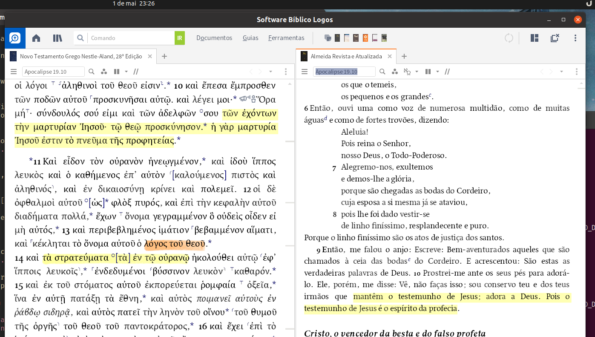
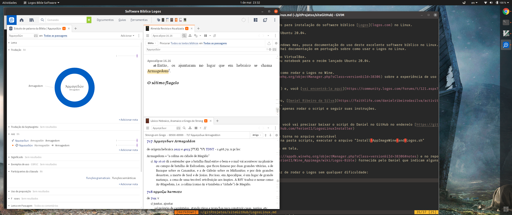

# Instalando o Logos no Linux
Este guia pretende ser uma referência em português para instalação do software bíblico [Logos](logos.com) no Linux.

Como base, estou usando uma instalação limpa do  Ubuntu 20.04.

## Introduão
Existe um extensa base de usuários Logos Mac e Windows mas, pouca documentação do uso deste excelente software bíblico no Linux.
Exceto pelo uso em uma VM rodando Windows, não achei documentação em português sobre como usar o Logos no Linux.

Até então semprei usei o software ou no iPad ou no VirtualBox.
Foi então que, nesta pandemia, após atulizar o meu notebook para o recém lançado Ubuntu 20.04.

## A grata surpresa
Achei no fórum de usuários do Logos referência a como rodar o Logos no Wine.
Existe uma página do no [AppDB](https://appdb.winehq.org/objectManager.php?sClass=version&iId=38306) sobre a experiência de uso do Logos no Wine.

A thread no fórum do Logos foi aberta em 2009(!!!) e, você [vai encontrá-la aqui](https://community.logos.com/forums/t/121.aspx?PageIndex=46).

Bom, em resumo, existe um projeto de um brasileiro, [Daniel Ribeiro da Silva](https://faithlife.com/danielribeirodasilva/activity), que escreveu em bash um instalador para Logos.
A solução é deveras criativa e funcional e, exige apenas rodar o script e seguir suas instruções.

## Passo a passo
Partindo de uma instalação limpa do Ubuntu 20.04, você vai precisar baixar o script do Daniel no GitHub no enderećo [https://github.com/ferion11/LogosLinuxInstaller](https://github.com/ferion11/LogosLinuxInstaller)
Aqui duas opcões:
- Baixar diretamente o script no endereco acima e torna no arquivo executável
- Clonar o repositório todo ai na sua máquina e, na pasta scripts, executar o arquivo "Install_AppImageWine_and_Logos.sh"

Ao executar o arquivo, basta seguir as instrućões em tela.

Existem dicas detalhadas no [appdb do wine](https://appdb.winehq.org/objectManager.php?sClass=version&iId=38306#notes) e no repositório da [imagem do Wine](https://github.com/ferion11/Wine_Appimage/wiki/Logos-Bible) fornecida pelo Daniel que indicam alguns ajustes, caso necessário.

Aqui, após terminar de rodar o script já fui capaz de rodar o Logos sem qualquer dificuldade:

