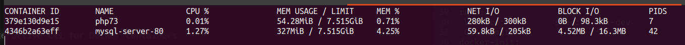
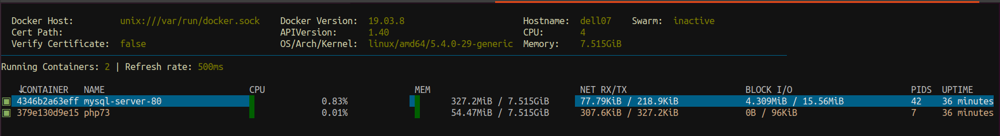
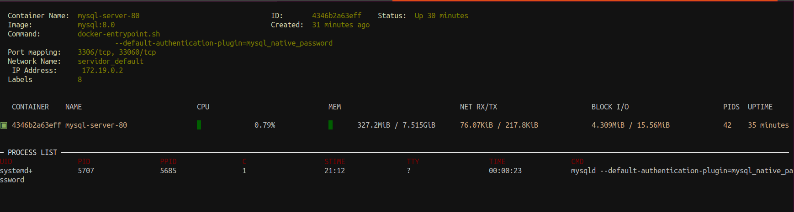

# Docker no Ubuntu 20.04

Bom, meu objetivo é mostrar um pouco do meu uso de conteiners no Linux, especialmente no Ubuntu, para meu ambiente pessoal de desenvolvimento.

Tive que reinstalar meu sistema outro dia após quase um ano usando Manjaro, e, logo em seguida alguns meses usando o Windows 10.

Fiz aqui alguns outros tutorias que você pode consultar [no index do site](README.md)


## Instalação do Docker
Para instalar:

    sudo apt install docker.io docker-compose

Depois (lembrando que na segunda linha, substituia pelo seu usuario/login do sistema):

    sudo systemctl enable --now docker
    sudo usermod -aG docker seu_usuario

Depois só checar:

    docker --version


Saindo algo assim, está tudo ok para começar:
```
thiago@dell07:~$ docker version
Client:
 Version:           19.03.8
 API version:       1.40
 Go version:        go1.13.8
 Git commit:        afacb8b7f0
 Built:             Wed Mar 11 23:42:35 2020
 OS/Arch:           linux/amd64
 Experimental:      false

Server:
 Engine:
  Version:          19.03.8
  API version:      1.40 (minimum version 1.12)
  Go version:       go1.13.8
  Git commit:       afacb8b7f0
  Built:            Wed Mar 11 22:48:33 2020
  OS/Arch:          linux/amd64
  Experimental:     false
 containerd:
  Version:          1.3.3-0ubuntu2
  GitCommit:
 runc:
  Version:          spec: 1.0.1-dev
  GitCommit:
 docker-init:
  Version:          0.18.0
  GitCommit:
```
 

## Criando meus conteiners
Basicamente tenho uma estrutura de três conteiners:
1.  Para minhas bases mysql;
2.  Para rodar o apache2 com php;
3.  Ainda em teste... um conteiner do miktex para compilar arquivos Latex.

Uma ideia para testes é depois subir um nginx para testar o proxy web... coisas pra depois.


## Repositório
Os arquivos de configuração estão no meu [repositório dockerconf](https://github.com/thiagoserra/dockerconf).


### As tarefas
- Criar o arquivo DockerFile para o servidor web com php
- Criar um build do conteiner na pasta onde está o arquivo Dockerfile:

```
    docker build -t web .
```

- Criar o arquivo docker-compose.yml que contém a identificação dos serviços do banco e web.
- Criar as pastas locais que serão montadas como volume no Docker.
- Minha estrutura de diretório é:
- Criei um arquivo my.conf com algumas configurações necessárias para o meu servidor de banco de dados

```
\home\thiago\servidor\
    |- www\
    |- mysqldata\
    |- Dockerfile
    |- docker-compose.yml
    |- my.cnf
```
- Isso permite persistir os dados do servidor de banco e web numa pasta única, organizada, sem necessidade de subir o conteiner com dados, já que estamos num ambiente de testdesenvolvimento.
- Subir a estrutura e testar!


# Testes
Rodar o `docker-compose-up` e ver o que acontece.... 

Normalmente rodaria tudo bem...


## O que talvez seja necessário
A imagem latest do mysql-server-8.0 do docker hub exigiu algumas configurações desta vez.
- Setar algumas variáveis no docker-compose.yml
- Acessar a base pelo shell e adicionar acesso ao usuário admin manualmente:

```
    docker exec -it mysql-server-80  bash -l

    mysql -u root -p
```

No console do mysql executar:

```
    CREATE USER 'admin'@'%' IDENTIFIED BY 'superPassWord';

    GRANT ALL ON *.* TO 'admin'@'%';
```


## Monitorando a estrutura
Uma ferramenta simples vem com o próprio docker, o stats:

    docker stats

O comando exibe as estatísticas de uso de memória, processador, processos... 



Existem algumas opções neste comando que estão bastante explícitas na [vasta documentação](https://docs.docker.com/engine/reference/commandline/stats/).


Eu gosto de um client específico chamado [dry](https://github.com/moncho/dry), um terminal bastante completo que permite acompanhar diversas informações sobre os conteiners.
Vale a pena experimentar (existe outros... eu uso este).








A instalação é bastante simples:

    curl -sSf https://moncho.github.io/dry/dryup.sh | sudo sh

Depois:

    chmod 755 /usr/local/bin/dry


E ai só rodar o dry.

