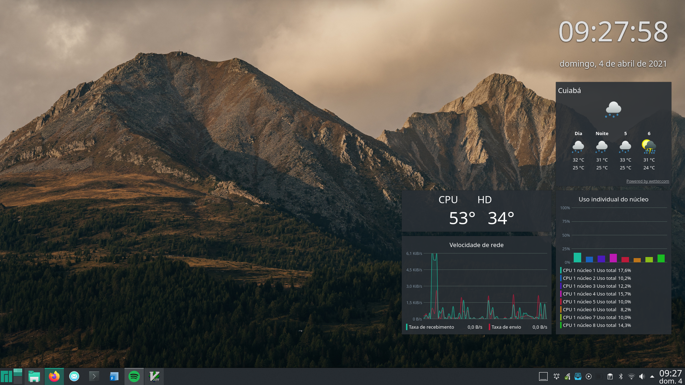
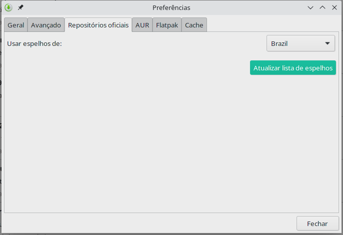
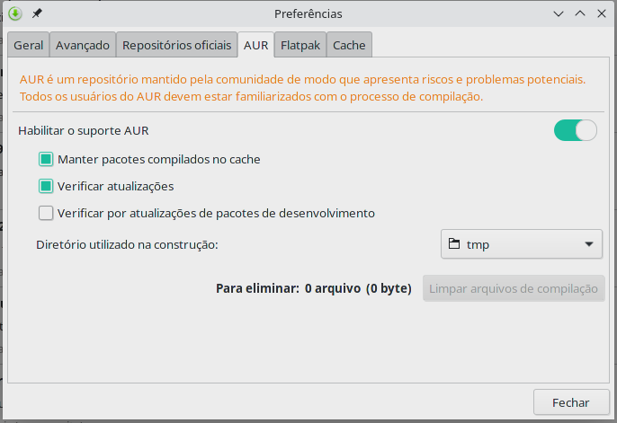
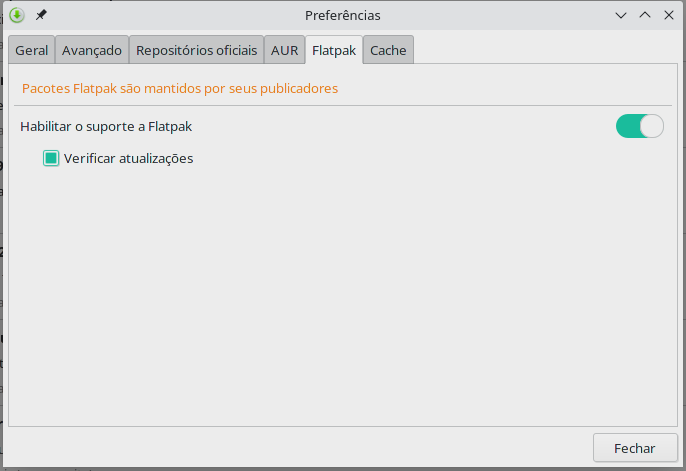

# Meu guia para o Posinstall do Manjaro
Estou a alguns dias deixando redonda meu setup do Manjaro 21.0 (ORNARA) com o KDE Plasma 5.21.
Usei regularmente o Manjaro 17-18 por alguns meses em outro notebook, agora, com a máquina nova eu havia tentando usar o Ubuntu 20.04, porém, várias questões começaram a me chatear... 
Decidi mudar e voltar para o Manjaro.

Esse é meu guia para manter o histórico aqui do que eu fiz para deixar o Manjaro "ok" no meu notebook (DELL 5490, A40S), e, quem sabe, ajudar alguém ai a fazer o mesmo.




## Atualizações e repositórios
Primeiro passo, mudar os servidores para o Brasil e mandar atualizar a lista:




Habilitar os repositórios AUR(Arch User Repositores) e Flatpak:






## Mudar o shell (zsh!!!) 
```
  chsh -s /bin/zsh
```

  Você vai perceber que a galera do Manjaro já fez umas personizações básicas do Zsh.

## Eliminar o delay do grupo
Editar o arquivo de iniciação do grupo e setar o delay para zero.

```
$ sudo nano /etc/default/grub
$ sudo update-grub
```

## Habilitar a camêra virtual do OBS
A instalação do OBS pode ser feita com o pamac ou pacman, contudo, um detalhe sempre é importante lembrar.
A partir da versão 26.0.1 (salvo engano),  camêra virtual do OBS é um recurso embutido sem necessidade de plugins.
Contudo, para habitá-lo, é necessário carregar um módulo no kernel (v412loopback).

Isso é feito primeiro instalando o kernel-headers da sua versão de kernel em uso.

```
$ uname -a 
```

Em seguida, processeguir com a instalação do módulo e do kernel headers:

```
$ sudo pacman -S v412loopback-cli linux-headers
``` 


## Instalar alguns aplicativos de compactação e outros:
  ```
  sudo pacman -S zlib p7zip unzip zip zziplib tar gzip bzip2 unrar rsync exfat-utils fuse-exfat ntfs-3g
  ``` 

## Instalar spotify, chromium e Atom.io (rep. AUR):
  ```
  yaourt -S spotify chromium atom
  ``` 

## Instalar as fontes TTF:
  ``` 
  sudo pacman -S opendesktop-fonts
  yaourt -S ttf-ms-fonts ttf-ubuntu-font-family
``` 

## Instalar o Bash-it
Baixar e instalar... já sou viciado.
[Bash-it](https://github.com/Bash-it/bash-it)


## Remover o octopi no KDE e instalar o pamac
Gosto mais da interface do Pamac.... 

Tem que ativar os repositórios AUR no pamac (no menu preferências).
(passo opcional)
  ``` 
  sudo pacman -R octopi
  sudo pacman -S pamac
``` 


## Alguns outros programas que utilizo:
  ``` 
  sudo pacman -S wireshark-qt aircrack-ng mc gimp inkscape filezilla nmap
``` 


## Pacotes legais de ícones para o KDE:
```
  yaourt -S papirus-icon-theme-git antu-plasma-theme-git la-capitaine-icon-theme-git
``` 


## Para programação Web

Já instalado o Atom (o editor de texto que utilizo, escolha o seu...)

Eu programo em PHP e, utilizo o Apache, MySQL (MariaDB) e o PHP 7.


### Instalando o mariadb
``` 
sudo pacman -S mysql
``` 

Para inicializar o diretório de onde as bases do ficarão:
``` 
sudo mysql_install_db --user=mysql --basedir=/usr --datadir=/var/lib/mysql
``` 

Configurando o systemd para iniciar o banco:
``` 
systemctl enable mysqld
systemctl start mysqld
``` 

Setando a senha do root para acesso ao MySQL e outras questões de segurança:
``` 
sudo mysql_secure_installation

``` 


### Instalando o PHP
``` 
sudo pacman -S php php-apache php-gd php-mcrypt
``` 


### Instalando o Apache

``` 
sudo pacman -S apache
``` 


Configurando o systemd para iniciar o Apache:
``` 
systemctl enable httpd
systemctl start httpd
``` 

Algumas edições que faço no httpd.conf (/etc/httpd/conf/httpd.conf)

* Alterar a diretiva DocumentRoot para uma pasta personalizada.
* Alterar o dir_module para incluir no DirectoryIndex o index.php
* comentar o LoadModule mpm_event_module modules/mod_mpm_event.so
* descomentar o LoadModule mpm_prefork_module modules/mod_mpm_prefork.so
* Incluir as linhas abaixo para interpretar o PHP:
``` 
LoadModule php7_module modules/libphp7.so
AddHandler php7-script php
Include conf/extra/php7_module.conf
``` 

## Instalando o Latex
Para minhas aulas eu tenho utilizado o Latex para escrever as provas e apresentações. 

A instalação no Manjaro é bem tranquila.

Você pode instalar pacote por pacote ou, instalar o metapacote most e, ter o core e pacotes adicionais instalado de uma vez.
``` 
sudo pacman -S texlive-most
``` 


Você pode usar seu editor de texto preferido para editar documentos tex, eu gosto do Kile.
``` 
sudo pacman -S kile
``` 


Feito isso, é só ir usando.
O que faltar, instalo depois!

Espero ter ajudado!

Thiago
(thiagonce (at) gmail.com)


