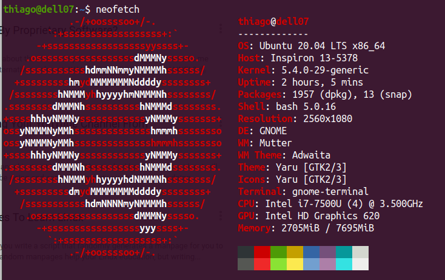
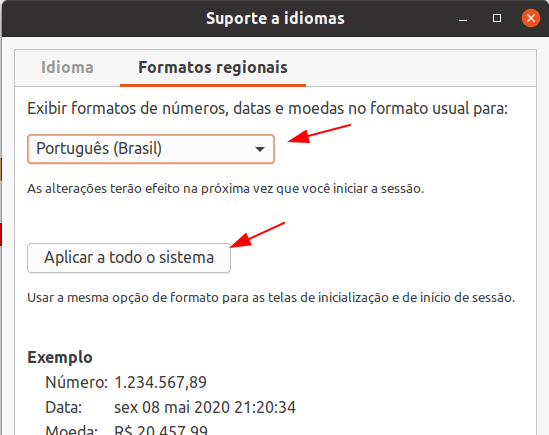
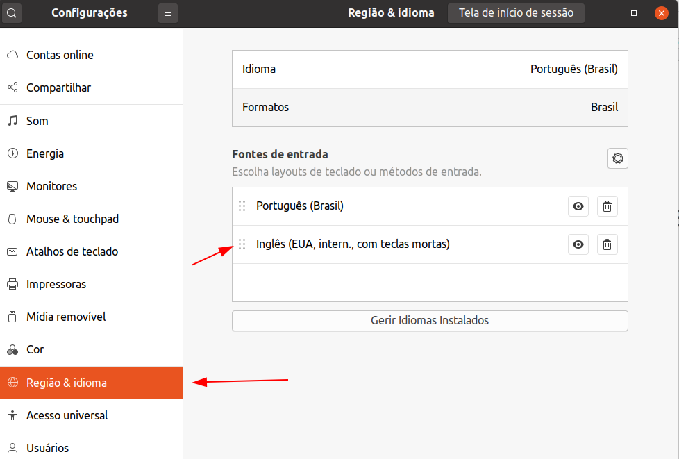

# Setup básico ou post-install do Ubuntu 20.04

## Tópicos

1. [O que não está aqui](#intro)
2. [Primeiro, excluir](#ponto1)
3. [Atualizar](#ponto2)
4. [Instalar alguns softwares de uso corrente](#ponto3)
5. [Instalacão do youtube-dl](#ponto5)
6. [Docker](#ponto6)
7. [Hardware](#ponto7)
8. [Dotfiles: projeto no github](#ponto8)
9. [Sincronizar o horário](#ponto9)
10. [Latex](#ponto10)

## O que não está aqui 
Download e instalação manual dos softwares abaixo:

  - Browser: [Vivaldi](https://vivaldi.com/pt-br/)
  - [Insync](https://www.insynchq.com)
  - [Ulauncher](https://ulauncher.io)

## Primeiro, excluir 

    sudo apt purge thunderbird* rhythmbox firefox* hexchat
    sudo apt remove vim-tiny

## Atualizar 

    sudo apt update
    sudo apt upgrade

## Instalar alguns softwares de uso corrente 

    sudo apt install ubuntu-restricted-extras
    sudo apt install gnome-sushi flameshot
    sudo apt install mc htop ncdu neofetch curl

    sudo apt install speedtest-cli speedometer
    sudo apt install p7zip-full rar
    sudo apt install ntfs-3g exfat-fuse exfat-utils
    sudo apt install fonts-liberation fonts-inconsolata ttf-mscorefonts-installer
    sudo apt install git vim ctags
    sudo apt install build-essential apt-transport-https ca-certificates software-properties-common

    sudo apt install audacity gimp inkscape pdfshuffler
    sudo snap install bing-wall

    sudo apt install obs-studio obs-plugins
    sudo snap install kdenlive

## Instalacão do youtube-dl 

    sudo curl -L https://yt-dl.org/downloads/latest/youtube-dl -o /usr/local/bin/youtube-dl
    sudo chmod a+rx /usr/local/bin/youtube-dl

## Docker 

Para instalar:

    sudo apt install docker.io docker-compose

Depois:

    sudo systemctl enable --now docker
    sudo usermod -aG docker seu_usuario

Depois só checar:

    docker --version

## Hardware 

O único hardware que precisa de atenção é meu teclado.
Uso um Logitech G413 (layout americano).
Os acentos funcionam normalmente como layout do teclado após a escolha do idioma português do brasil para todo o sistema, mas o cedilha nada...

Para configurá-lo no Ubuntu, é preciso escolher o layout:

E adicionar no arquivo /etc/environment a seguinte linha:

    export GTK_IM_MODULE=cedilla

Depois de um reboot funciona tranquilo o cedilha.

## Dotfiles: projeto no github 

Inicialmente, retornar meus arquivos dot que estão aqui no [github](https://github.com/thiagoserra/dotfiles).

Principalmente o .bashrc e o .vimrc :-)

## Sincronizar o horário do micro 
Para isso existe um excelente tutorial do NTP.br que eu recomendo.

https://ntp.br/guia-linux-avancado.php

## Latex 
O que é o Latex?

Bom... a melhor e mais concisa explicação está no site do projeto:

> LaTeX is a high-quality typesetting system; it includes features designed for the production of technical and scientific documentation. LaTeX is the de facto standard for the communication and publication of scientific documents. LaTeX is available as free software.

Para longos trabalhos escritos eu continuo usando Latex desde a faculdade... é viciante, e o resultado é simplesmente incomparável - qualquer processador de texto exigirá muito mais trabalho do que simplesmente escrever o texto...

Para instalar o processador Latex no Ubuntu:

    sudo apt install texlive-lang-portuguese texlive-base texlive-extra-utils texlive-publishers

Só começar a gerar seu documentos que sua máquina estará pronto para compilá-los.
